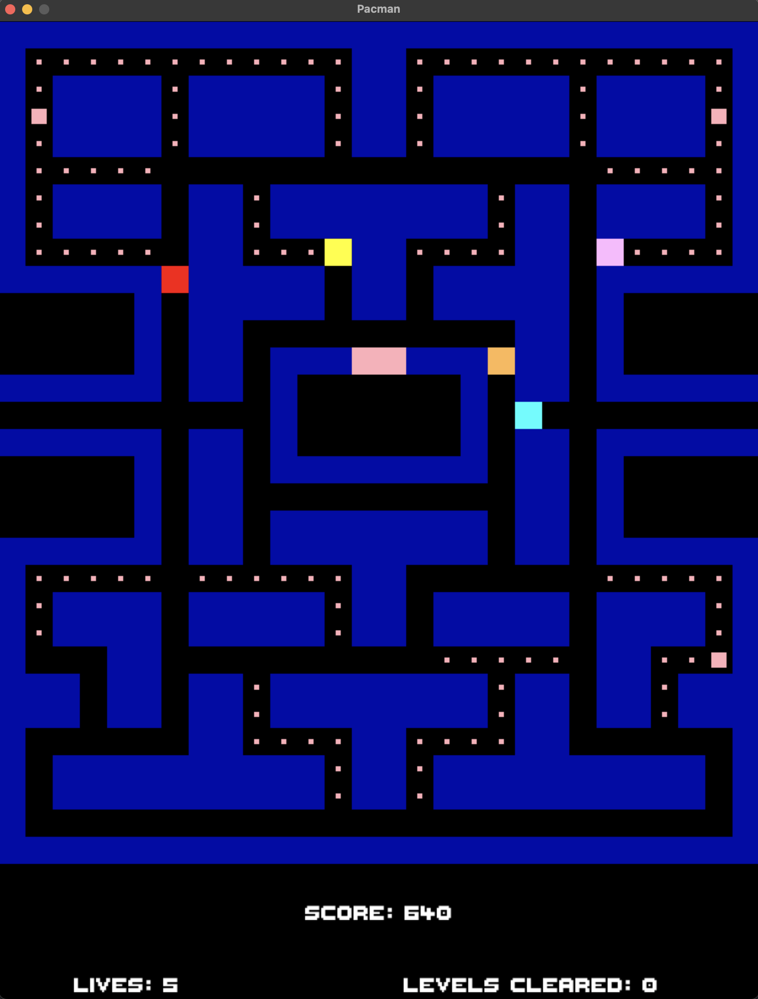
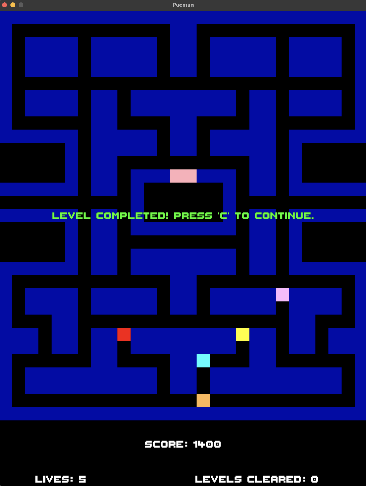
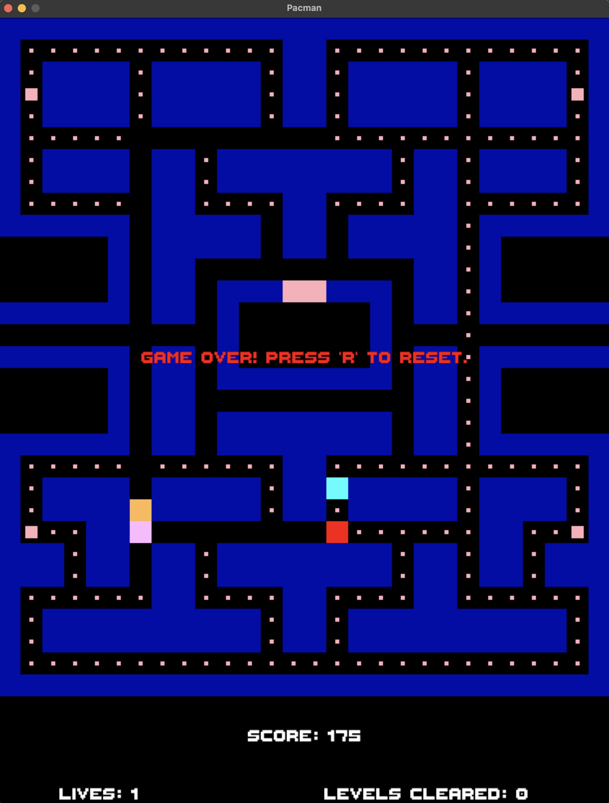

# SDL2-Pacman
An extremely simplified Pacman game written using SDL2 library.

Compiled with provided Makefile.

Sources:
  - https://www.gamedeveloper.com/design/the-pac-man-dossier
  - https://gameinternals.com/understanding-pac-man-ghost-behavior
  - http://donhodges.com/pacman_pinky_explanation.htm

